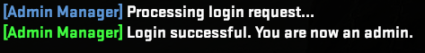

import BrowserWindow from '@site/src/components/BrowserWindow';
import Tabs from '@theme/Tabs';
import TabItem from '@theme/TabItem';

## Introduction
Wondering how to set yourself as an admin on your CS2 Pro server? Follow these step-by-step instructions to get started.

PRO server only

:::note
1. Enter the RCON password you set for your CS2 Pro Server. (Don’t forget it!)
2. Connect to your CS2 Pro Server.
3. Open your `say` chat and type: `/login RconPass` (replace RconPass with your actual RCON password) 
:::

**Here's an example of how it looks after adding yourself as a server admin.**

## Chat Commands

| Chat Command | Example | Description |
|--------------|---------|-------------|
| `/login [RconPass]` | - | Gives you server admin using RCON password |
| `/addadmin <SteamID64\|Name> <immunity> <flags>` | `/addadmin 76561198975357634 99 z` | Add admin with SteamID64 |
| `/addadmin <SteamID64\|Name> <role>` | `/addadmin 76561198975357634 Helper` | Add admin with a role |
| `/removeadmin [target]` | `/removeadmin 76561198975357634` | Removes admin by SteamID64 or name |
| `/admins` | - | Shows list of admins |
| `/addadmin help` | - | Lists `/addadmin` usage |
| `/rolehelp` | - | Lists role-related commands |

## Role Management

| Command | Description |
|---------|-------------|
| `/css_addrole VIP ao 10` | VIP role with reservation, immunity 10 |
| `/css_addrole Moderator abdh 50` | Moderator role with ban/kick/chat, immunity 50 |
| `/css_addrole Admin abcdefghijklmn 100` | Full admin role, immunity 100 |
| `/css_addrole Owner z 100` | Full permissions, max immunity |
| `/css_addadmin [PlayerName\|SteamID64] VIP` | Gives player VIP role |
| `/css_removeRole Owner` | Deletes Owner role |
| `/css_roles` | Lists all roles |
